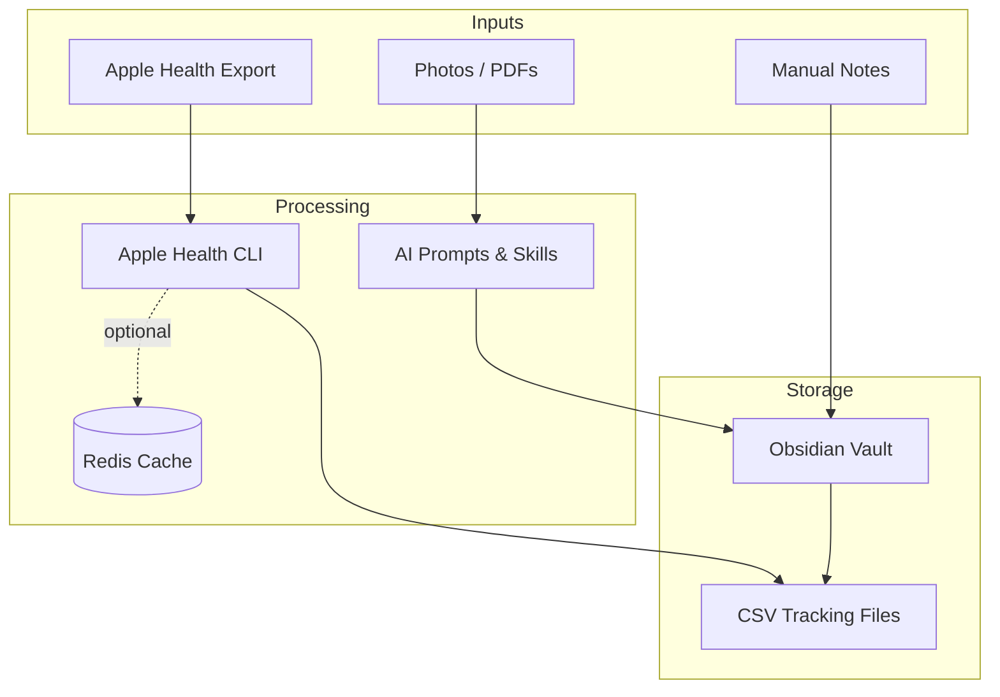
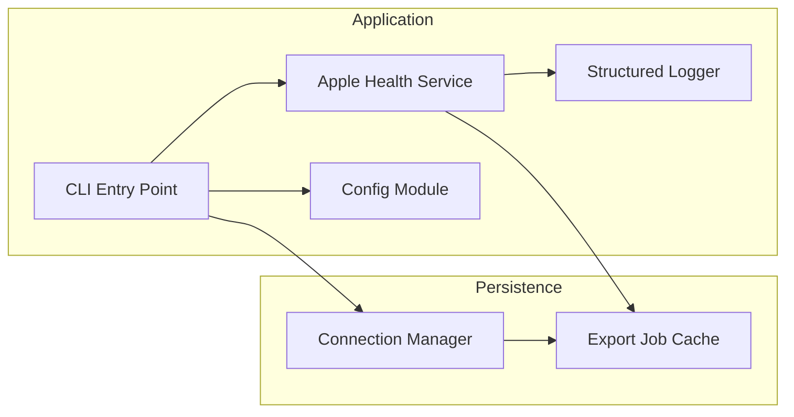
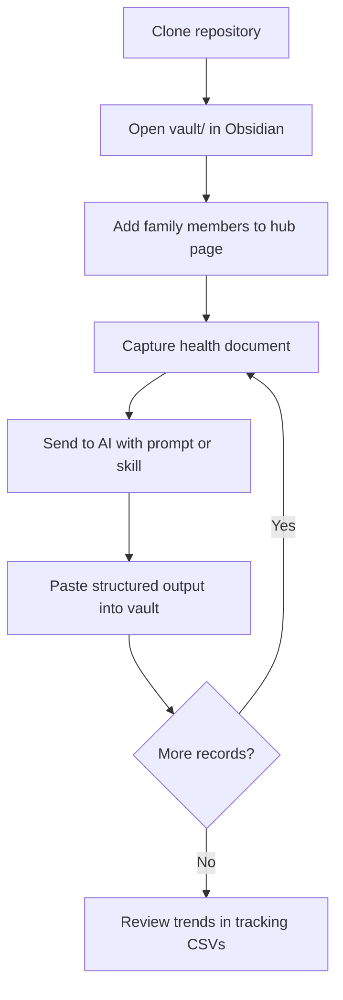
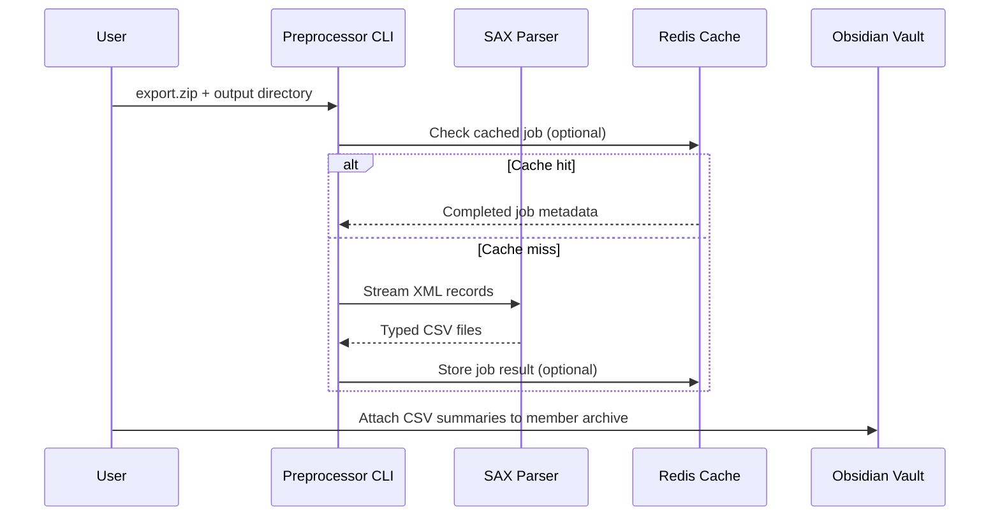

# AI Health Vault

A local-first family health archive that combines Obsidian templates, AI prompt workflows, and a TypeScript preprocessing pipeline for Apple Health exports.

Your health data stays on your machine. AI assists with structuring and analysis — you control what leaves your device.

---

## Table of Contents

- [Overview](#overview)
- [Features](#features)
- [Architecture](#architecture)
- [Workflows](#workflows)
- [Project Structure](#project-structure)
- [Installation](#installation)
- [Configuration](#configuration)
- [Development](#development)
- [Testing](#testing)
- [Troubleshooting](#troubleshooting)
- [Contributing](#contributing)
- [FAQ](#faq)
- [License](#license)

---

## Overview

AI Health Vault is designed for families who want structured health records without surrendering privacy to commercial apps. Clone the repository, open the Obsidian vault, and use included prompts or Claude Code skills to transform photos, PDFs, and wearable exports into organized Markdown and CSV files.

Version 2 adds a production TypeScript runtime with strict typing, optional Redis-backed export job caching, structured logging, and a full build/lint/test pipeline.

---

## Features

| Capability | Description |
|------------|-------------|
| **Obsidian vault templates** | Hub pages, member archives, tracking CSVs, and field standards |
| **Eight AI workflows** | Checkup extraction, medication recognition, trend analysis, visit prep, Apple Watch analysis, family-friendly summaries, follow-up calendar, daily health plan |
| **Claude Code skills** | Auto-loaded skill definitions mirroring the prompt library |
| **Apple Health preprocessor** | Streaming XML/ZIP parser that splits large exports into typed CSV files |
| **Optional Redis cache** | Persists export job metadata for repeated preprocessing runs |
| **Strict TypeScript** | Typed services, validated configuration, and comprehensive unit tests |

---

## Architecture



### Component Layers



---

## Workflows

### New user setup



### Apple Health import



---

## Project Structure

```
ai-health-vault/
├── src/
│   ├── cli/                  # Command-line entry points
│   ├── config/               # Environment configuration (Zod-validated)
│   ├── errors/               # Typed application errors
│   ├── logging/              # Structured JSON logger
│   ├── redis/                # Connection manager and export job cache
│   └── services/
│       └── apple-health/     # Streaming preprocessor implementation
├── tests/
│   ├── fixtures/             # Sample Apple Health XML
│   └── unit/                 # Vitest unit tests
├── vault/                    # Obsidian vault template
├── prompts/                  # Portable AI prompt library
├── .claude/skills/           # Claude Code skill definitions
├── guides/                   # Setup guides and FAQ
└── docs/internal/            # Engineering audit notes
```

**Design decisions**

- `src/services/` holds domain logic; infrastructure lives in `src/redis/`, `src/config/`, and `src/logging/`.
- Content assets (`vault/`, `prompts/`, `.claude/`) remain separate from application code.
- Tests mirror the `src/` layout under `tests/unit/`.

---

## Installation

### Prerequisites

- [Node.js](https://nodejs.org/) 20 or later
- [Obsidian](https://obsidian.md/) (recommended for vault management)
- [Redis](https://redis.io/) 6+ (optional, for export job caching)

### Setup

```bash
git clone https://github.com/runesleo/ai-health-vault.git
cd ai-health-vault
npm install
cp .env.example .env
```

Build and verify:

```bash
npm run validate
```

Open the vault:

1. Launch Obsidian → **Open folder as vault**
2. Select the `vault/` directory
3. Edit `健康管理中心.md` with your family member names

---

## Configuration

Copy `.env.example` to `.env` and adjust values:

| Variable | Default | Description |
|----------|---------|-------------|
| `LOG_LEVEL` | `info` | Logging verbosity: `debug`, `info`, `warn`, `error` |
| `REDIS_ENABLED` | `false` | Enable Redis-backed export job caching |
| `REDIS_URL` | — | Redis connection URL (required when enabled) |
| `REDIS_KEY_PREFIX` | `ai-health-vault:` | Key namespace prefix |
| `REDIS_MAX_RETRIES` | `10` | Maximum connection retry attempts |
| `REDIS_CONNECT_TIMEOUT_MS` | `10000` | Connection timeout in milliseconds |
| `REDIS_JOB_TTL_SECONDS` | `86400` | Export job cache TTL (24 hours) |

### Apple Health preprocessor

```bash
# Development (tsx)
npm run preprocess -- --input /path/to/export.xml --output ./csv-output

# Production build
npm run build
npx apple-health-preprocess --input export.zip --output ./csv-output --types heart_rate,step_count
```

Supported output types: `heart_rate`, `resting_heart_rate`, `walking_heart_rate_average`, `heart_rate_variability_sdnn`, `oxygen_saturation`, `vo2max`, `step_count`, `sleep_analysis`, `workouts`.

---

## Development

```bash
# Type check
npm run typecheck

# Lint
npm run lint
npm run lint:fix

# Format
npm run format:fix

# Run tests in watch mode
npm run test:watch

# Full validation pipeline
npm run validate
```

### Adding a new health workflow

1. Create a prompt file in `prompts/`
2. Add a matching skill in `.claude/skills/`
3. Update the vault hub page with workflow instructions
4. Document field mappings in `vault/知识库/推荐字段标准.md`

---

## Testing

```bash
npm test
```

Test suites cover:

- Apple Health type parsing and CSV generation
- Output directory safety checks
- Redis export job cache read/write operations
- Redis connection manager configuration guards

Run the full pipeline before submitting changes:

```bash
npm run validate
```

---

## Troubleshooting

### Preprocessor reports "Output directory must be empty"

The CLI refuses to write into a directory that already contains files. Provide a new path or clear the target directory first.

### Redis connection failures

1. Confirm Redis is running: `redis-cli ping` should return `PONG`
2. Verify `REDIS_URL` matches your instance
3. Set `REDIS_ENABLED=false` to run without caching

### TypeScript build errors after dependency updates

```bash
rm -rf node_modules dist
npm install
npm run validate
```

### AI output does not match vault field standards

Refer to `vault/知识库/推荐字段标准.md` and include it as context when prompting your AI assistant.

### Windows path issues

Use forward slashes or quoted paths:

```bash
npm run preprocess -- --input "D:/exports/export.xml" --output "./output"
```

---

## Contributing

1. Fork the repository and create a feature branch
2. Run `npm run validate` before committing
3. Keep commits focused and write descriptive messages
4. Update documentation when changing user-facing behavior
5. Open a pull request with a clear summary and test plan

See [CODE_OF_CONDUCT.md](CODE_OF_CONDUCT.md) and [SECURITY.md](SECURITY.md) for community and security guidelines.

---

## FAQ

**Do I need Redis?**
No. Redis is optional and only caches export job metadata.

**Which AI tools work?**
Any model that accepts text prompts: Claude, ChatGPT, Gemini, or local models via Ollama or LM Studio.

**Is my data sent to the cloud?**
Only if you paste it into a cloud AI service. The vault itself is local Markdown and CSV.

**Can I use this without Obsidian?**
Yes. Prompts, skills, and CSV outputs work with any editor.

**Where is the detailed setup guide?**
See [guides/快速开始.md](guides/快速开始.md) and [guides/FAQ.md](guides/FAQ.md).

---

## License

[MIT](LICENSE) — Copyright (c) Leo ([@runes_leo](https://x.com/runes_leo))
